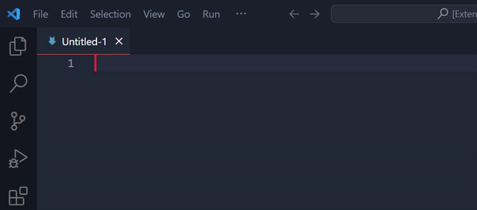
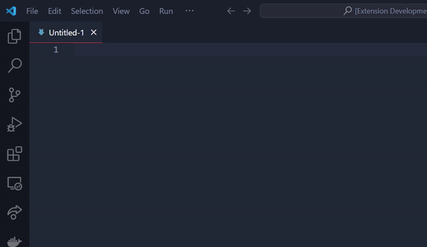
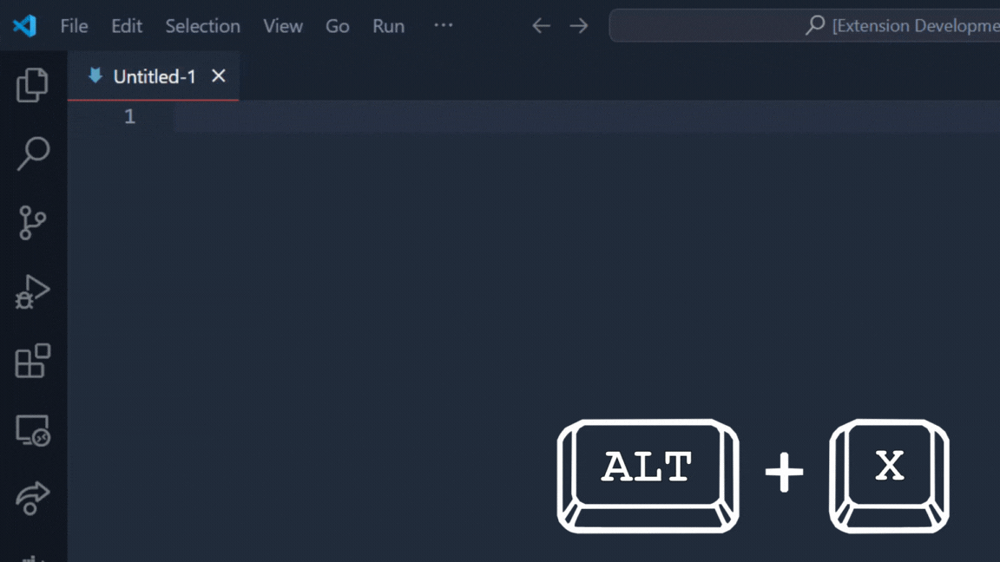

# Markdown Shortcuts

Easily write to markdown using snippet, shortcuts and specific automations for markdown documents

## Commands

| Command | Description |
|:-:|:-:|
| `Markdown Shortcuts: Bold Text` | *Bold text* |
| `Markdown Shortcuts: Italic Text` | *Italic text* |
| `Markdown Shortcuts: Table of contents` | *Create table of contents* |
| `Markdown Shortcuts: Update table contents` | *Update table of contents* |

### Table of contents

With this extension, you can easily generate a *Table of Contents* and choose its depth with the keyboard combination `CTRL+T`, and every time you add a new section that should be inserted in the *Table of Contents* because of its depth corresponding to the desired one, pressing again the keyboard combination `CTRL+T` will update the *Table of Contents*

!!! . Mettere una gif che mostra che se premi CTRL+T genera la TOC

> ⚠️: With the creation of the *Table of Contents* some generated comments will be present in your file, **do not delete those comments**

> ⚠️: If you want to change the depth of the generated *Table of Contents*, it is necessary to change the depth specified in the comment `<!-- toc start: (desired depth) [do not erase this comment] -->`

### Shortcuts 

| Shortcut | Description |
|:-:|:-:|
| `CTRL+B` | *Bold text* |
| `CTRL+I` | *Italic text* |
| `ALT+X` | *Check/Uncheck todo item (if you have cursor on the line)* |
| `CTRL+T` | *Create a table of contents* |

> ⚠️: If some shortcuts doesn't work, check the `Keyboard Shortcuts` in `Visual Studio Code` and check if there is any conflict for that key combination

## Snippets 

| Snippet | Description |
|:-:|:-:|
| `docs` | *Implements a structure for the documentation* |
| `code` | *Insert grave accent in order to write code(``)* |
| `mcode` | *Insert grave accent to write multiline code* |
| `right_arrow` | *Insert right arrow in **HTML code*** |
| `left_arrow` | *Insert left arrow in **HTML code*** |
| `table` | *Insert a table with 3 columns and 3 rows* |
| `todo` | *Starts a todo list* |

## Automatic lists

This extension implements an automation when you write lists into the markdown document.

Also the todo lists are dinamically, and you can use a shortcut `ALT+X` to check/uncheck a todo item.

## Release Notes

***Markdown-Shortcuts*** is an open source project and you can download it on [GitHub](https://github.com/EmilioGarzia/Markdown-Shortcuts)

### 1.0.0

First relase of `Markdown Shortcuts`

## Author

- 🧑‍💻 [*Emilio Garzia*](https://github.com/EmilioGarzia)
- 🧑‍💻 [*Luigi Marino*](https://github.com/luigimarino01)
- ☕ Offer us a virtual coffee on: [paypal](link.paypal)